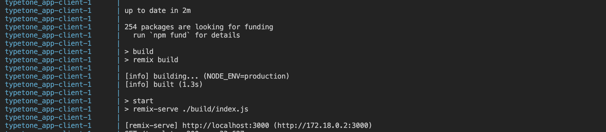

## Typetone Assignment

## Description
The overall purpose of the app is to be automating the process of summarizing PDF documents using a natural language processing model (GPT-3.5) and presenting the summarized content to the user in a user-friendly manner. It can be used in various scenarios where document summarization is required, such as research, content curation, or data analysis. This  application integrates Remix for the frontend, FastAPI for the backend, and the GPT-3.5 API for advanced natural language processing.

### Use Cases:

-Research: Researchers can use the app to quickly summarize academic papers, research articles, or lengthy documents, saving time and effort.

-Content Curation: Content creators and marketers can extract key information from various sources, helping them curate valuable content for their audiences.

-Educational Purposes: Students and educators can benefit from summarizing educational materials, making complex topics more accessible.

-General Use: Anyone dealing with extensive textual content can simplify their reading and comprehension tasks using this app.


### Table of Contents

- [Prerequisites](#prerequisites)
- [Getting Started](#getting-started)
  - [Cloning the Repository](#cloning-the-repository)
  - [Running the Docker Container](#running-the-docker-container)
- [Usage](#usage)

### Prerequisites

List any prerequisites the client should have installed on their machine:

- [Docker](https://www.docker.com/get-started)
- [Git](https://git-scm.com/)

### Getting Started


#### Cloning the Repository

```bash
git clone https://github.com/MaslovRustislav/typetone_app.git
cd typetone_app
```

#### Running the Docker Container

1.  Build the Docker container:

   ```bash
   docker-compose build
   ```

2. Start the Docker container:

```bash
export GPT_API_KEY=YOUR_OPEN_AI_API_KEY
docker-compose up
```  

3. Run the app:

After you see the same code in CLI you can run project using this url http://localhost:3000

### Usage

Once you have launched the application with your open ai key, you can
1) Go to the "Templates" tab in the navigation panel
2) Drag
PDF file in a block with the inscription "Drag 'n' drop PDF files here, or click to select PDF files"
3) After a while, in the “Document” window you can see a summary of your PDF file
---
